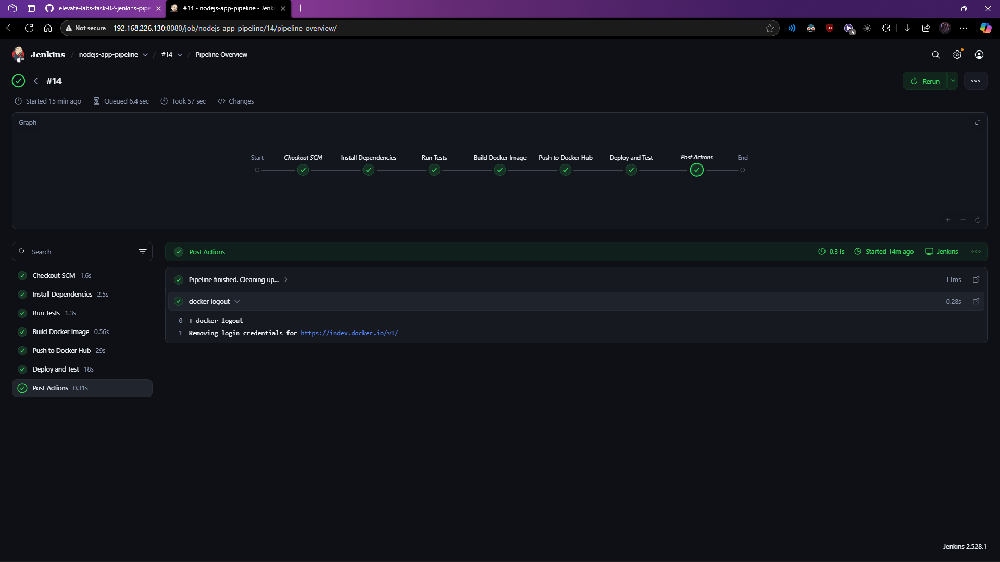

# Day 2: Jenkins CI/CD Pipeline for a Node.js Application

This project demonstrates the setup of a classic CI/CD pipeline using Jenkins, one of the most powerful and widely-used automation servers in the DevOps industry. The goal was to automate the build, test, and deployment of the Node.js application from Day 1, this time orchestrated by Jenkins.

The entire pipeline is defined as code using a `Jenkinsfile`, which is version-controlled alongside the application source code.

---

## Project Architecture and Setup

This project was built using a local development environment that mirrors a typical self-hosted setup.

*   **Jenkins Server:** Jenkins was installed and configured on an **Ubuntu 24.04 Server VM** running in VMware on a Windows 11 host. This provides an isolated, Linux-based environment for our automation server. All pipeline jobs were executed directly on this Jenkins server.

*   **Local Development:** All code, including the `Jenkinsfile`, was written in the CLI on the Ubuntu VM. The project repository was managed with Git from this same environment.

*   **GitHub to Jenkins Webhook:** To allow the public GitHub servers to communicate with the private Jenkins server running on the local VM, a secure tunnel was created using **ngrok**. `ngrok` generated a temporary public URL that was configured as a webhook in the GitHub repository. This webhook securely forwards `git push` events from GitHub to the Jenkins instance, enabling immediate, automated pipeline triggers.

---

## The CI/CD Pipeline Stages

The `Jenkinsfile` defines a multi-stage pipeline that executes automatically on every push to the `main` branch.

1.  **Install Dependencies & Test:**
    *   The pipeline first checks out the code.
    *   It uses `npm ci` to install all necessary dependencies from the `package-lock.json` file.
    *   It then runs `npm test` to execute unit tests and ensure code quality.

2.  **Build Docker Image:**
    *   Using the `Dockerfile` in the repository, Jenkins builds a new Docker image of the application.
    *   The image is tagged with the Docker Hub username and the `:latest` tag.

3.  **Push to Docker Hub:**
    *   The pipeline securely logs into Docker Hub using credentials stored safely within Jenkins.
    *   It then pushes the newly built Docker image to the Docker Hub registry, making it available for deployment.

4.  **Deploy and Test (Smoke Test):**
    *   To verify the integrity of the pushed image, the pipeline runs a "smoke test".
    *   It pulls the image from Docker Hub and runs it as a container on the Jenkins agent.
    *   A unique, dynamic port is used for the container to prevent conflicts and allow for concurrent builds.
    *   After a brief pause, it sends a `curl` request to the container's endpoint.
    *   If the application responds with a success code, the test passes, and the container is stopped and removed. If not, the pipeline fails.

### The Jenkinsfile

This is the code that defines the entire automation process:

```groovy
// This is the main wrapper for my entire Declarative Pipeline.
pipeline {
    // I'm telling Jenkins it can run this on any available machine (or "agent").
    agent any

    // Here, I set up some global variables to reuse throughout the pipeline.
    environment {
        // This ID points to the secret username/password I stored safely in Jenkins.
        DOCKERHUB_CREDENTIALS_ID = 'dockerhub-credentials'
        // My Docker Hub username, so I don't have to hardcode it everywhere.
        DOCKERHUB_USERNAME     = 'adityajareda'
        // The name for the Docker image we're going to build.
        DOCKERHUB_IMAGE_NAME   = 'nodejs-demo-app'
    }

    // This is where I define the actual stages of my CI/CD pipeline.
    stages {

        // First, I'll install dependencies and run tests to make sure the code is solid.
        stage('Install Dependencies & Test') {
            steps {
                echo 'Installing ALL dependencies for testing...'
                // Using '--production-only' tells npm to ignore devDependencies like testing frameworks.
                sh 'npm ci --production-only' 
                
                echo 'Running tests...'
                // This runs the test script from package.json. If it fails, the pipeline stops here.
                sh 'npm test'
            }
        }

        // Once the tests pass, it's time to package the application into a Docker image.
        stage('Build Docker Image') {
            steps {
                echo 'Building the Docker image...'
                // I'm building the image using my Dockerfile and tagging it with my username.
                sh "docker build -t ${DOCKERHUB_USERNAME}/${DOCKERHUB_IMAGE_NAME}:latest ."
            }
        }

        // Now I'll publish the image to Docker Hub so it can be used anywhere.
        stage('Push to Docker Hub') {
            steps {
                echo 'Pushing image to Docker Hub...'
                // This is the secure way to handle my password. Jenkins injects it safely.
                withCredentials([usernamePassword(credentialsId: DOCKERHUB_CREDENTIALS_ID, usernameVariable: 'DOCKER_USER', passwordVariable: 'DOCKER_PASS')]) {
                    // Logging into Docker Hub without my password ever appearing in the logs.
                    sh "echo ${DOCKER_PASS} | docker login -u ${DOCKER_USER} --password-stdin"
                    // Pushing the image up to the Docker Hub registry.
                    sh "docker push ${DOCKERHUB_USERNAME}/${DOCKERHUB_IMAGE_NAME}:latest"
                }
            }
        }

        // A quick "smoke test" to prove the image I just pushed actually works.
        stage('Deploy and Test') {
            steps {
                // I need a 'script' block here to define some variables.
                script {
                    // Creating a unique container name so my builds don't ever clash.
                    def containerName = "nodejs-test-${BUILD_NUMBER}"
                    // Creating a unique port so I can run multiple pipelines at once.
                    def testPort = "909${BUILD_NUMBER % 100}"

                    echo "Deploying test container: ${containerName} on port ${testPort}"
                    // Starting the container. The '--rm' flag is great for automatic cleanup.
                    sh "docker run --rm -d -p ${testPort}:8080 --name ${containerName} ${DOCKERHUB_USERNAME}/${DOCKERHUB_IMAGE_NAME}:latest"

                    echo 'Giving the app a few seconds to start up...'
                    sh 'sleep 5'

                    echo 'Testing the application endpoint...'
                    // Using 'curl -f' is a robust way to check if the server is healthy.
                    sh "curl -f http://localhost:${testPort}"

                    echo 'Test successful! Stopping the container now...'
                    // Stopping the container triggers the --rm flag to remove it.
                    sh "docker stop ${containerName}"
                }
            }
        }
    }

    // This 'post' section runs after all the stages are finished.
    post {
        // I want this to run 'always', whether the pipeline passed or failed.
        always {
            echo 'Pipeline finished. Cleaning up...'
            // Good practice to always log out at the end.
            sh 'docker logout'
        }
    }
}
```

## Verification Screenshot

The following screenshot shows the successful execution of the pipeline in Jenkins, with all stages passing.


